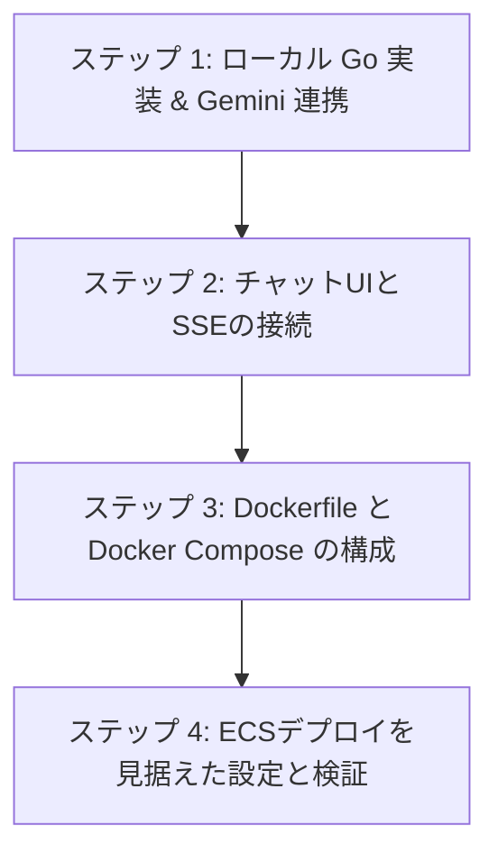

# Go x Docker x SSE x Gemini API チュートリアル設計書

本設計書は、将来的に AWS ECS (Elastic Container Service) などのコンテナオーケストレーション環境へデプロイすることを見据え、**Go**、**Docker**、**SSE (Server-Sent Events)**、および **Gemini API** を組み合わせたAIチャットバックエンドサービスをローカルで再現・開発するためのチュートリアルシナリオと技術選定を定義したものです。

---

## 1. 技術選定 (Technology Selection)

AWS ECS へのデプロイや本番運用を意識し、軽量さ、ポータビリティ、セキュリティ、およびリアルタイム性を重視した技術を採用します。

| 技術要素 | 選定技術 | 選定理由・ECSデプロイ時の考慮点 |
| :--- | :--- | :--- |
| **プログラミング言語** | **Go (Golang)** | フットプリントが非常に小さく、起動が高速でメモリ効率が高いため、ECS (Fargate) のリソース（CPU/Memory）を節約できます。 |
| **Webフレームワーク** | **Go標準パッケージ (`net/http`)** | 外部依存を極力減らし、Dockerイメージサイズを最小化します。Goの標準 `net/http` は十分に強力で、SSEの実装も容易です。 |
| **AI SDK** | **`github.com/google/generative-ai-go/genai`** | Google公式のGemini API SDK。安全かつ簡単にストリーミングレスポンス (`GenerateContentStream`) をハンドリングできます。 |
| **コンテナ化 (Docker)** | **マルチステージビルド (Multi-stage Build)** Builder: `golang:1.26-alpine` Runner: `alpine` (CA証明書付き) | 本番環境で安全に動かすため、開発用のツールを含まない最小限の軽量コンテナを作成します。Gemini API (HTTPS) と通信するために `ca-certificates` が必須です。 |
| **ローカル環境実行** | **Docker Compose** | 開発環境の簡略化。Gemini APIキー等の環境変数を安全かつ簡単にコンテナへ注入します。 |
| **リアルタイム通信** | **Server-Sent Events (SSE)** | WebSocketに比べ、HTTP/1.1やHTTP/2上で動作するため、AWS ALB (Application Load Balancer) を通した負荷分散や接続維持が非常にシンプルです。 |

---

## 2. チュートリアルシナリオ (Scenario Roadmap)

ローカル環境で「Docker上で動き、GeminiとSSE連携するGoサービス」を完成させるための4つのステップです。

### 【ステップ 1】ローカル Go 実装 & Gemini 連携
- Goから Gemini API への疎通確認を行います。
- APIキーは環境変数 `GEMINI_API_KEY` から読み込みます（ECSのSecrets Manager連携の模擬）。
- クライアントからのリクエストを受け取り、Geminiから返ってくるストリーミングレスポンスをコンソールに出力する基礎部分を作ります。

### 【ステップ 2】チャットUIとSSE (Server-Sent Events) の接続
- クライアント（フロントエンド）と Go バックエンドの間で SSE コネクションを確立します。
- クライアントが「プロンプト」を送信すると、Go バックエンドが Gemini API から取得したテキストチャンクを順次 SSE の `data` フレームとしてクライアントへプッシュ送信（ストリーミング配信）します。
- 接続が途中で切れた場合の自動再接続 (retry) やコンテキストキャンセル（ユーザーがブラウザを閉じたときにGeminiへのリクエストもキャンセルする処理）の実装。

### 【ステップ 3】Dockerfile と Docker Compose の構成
- **Dockerfile (マルチステージビルド)** の作成:
  1. Goコードのコンパイルを行う `builder` ステージ。
  2. 実行用バイナリと静的ファイル、そして SSL 接続に必要な `ca-certificates` のみを載せる `runner` ステージ。
- **docker-compose.yml** の作成:
  - ローカルで `.env` ファイルから `GEMINI_API_KEY` をロードし、コンテナへ動的に注入する設定。

### 【ステップ 4】ECSデプロイを見据えた構成検証
- ローカルの Docker コンテナでビルドおよび実行し、ブラウザから AI チャットのストリーミングが完全に動作することを確認します。
- **ECS (Fargate) 公開時に必須となる考慮点**の学習:
  - **ロードバランサー (ALB) のタイムアウト設定**: SSEは接続が維持され続けるため、ALBの「アイドルタイムアウト」や「書き込みタイムアウト」の調整が必要です。
  - **バッファリングの無効化**: リバースプロキシやCDNがレスポンスをバッファリングするとSSEがストリーミングで届かなくなります。ヘッダー (`X-Accel-Buffering: no` 等) の設定を理解します。

---

## 3. 次のアクション

このチュートリアルシナリオに沿って、まずは**既存のプロジェクト構成を拡張**し、Gemini API と連携した Go の SSE 実装を進めていきます。

> [!NOTE]
> チュートリアルを進めるには **Gemini API Key** が必要となります。事前にご用意いただき、ローカル開発用に `.env` ファイルなどへ設定します。
